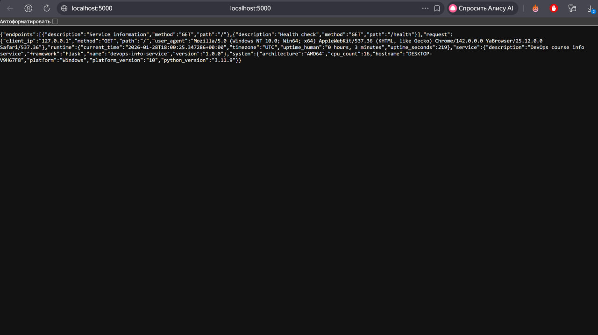
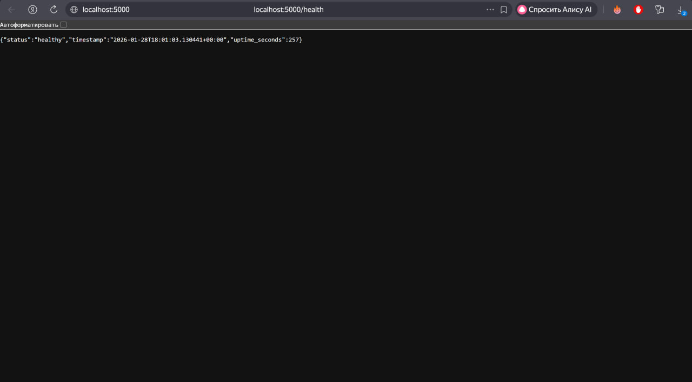
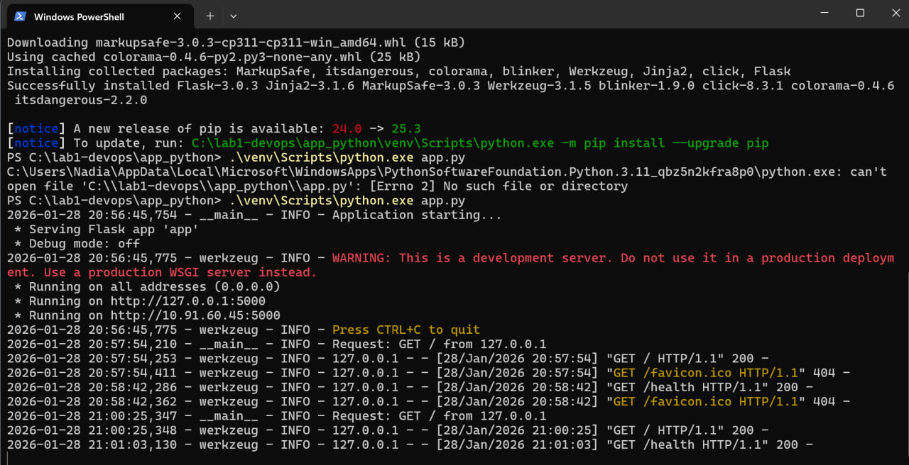

# LAB01 - DevOps Info Service

## Framework Selection
Flask 3.0.3 - lightweight framework suitable for simple APIs and microservices.

## Best Practices Applied
1. Structured logging with timestamps
2. Error handling for 404/500 responses  
3. Environment variables for configuration
4. PEP8 compliant code organization

## API Documentation
GET / - Service and system information
GET /health - Health check endpoint

text

## Testing Evidence

## GitHub Community Engagement
- Starred: inno-devops-labs/DevOps-Core-Course
- Starred: simple-container-com/api
- Following: Cre-eD, marat-biriushev, pierrepicaud
- Following 3 classmates

Stars increase project visibility. Following helps track best practices.

## Challenges & Solutions
- Windows venv activation via direct python.exe path
- Client IP shows 127.0.0.1 for localhost correctly